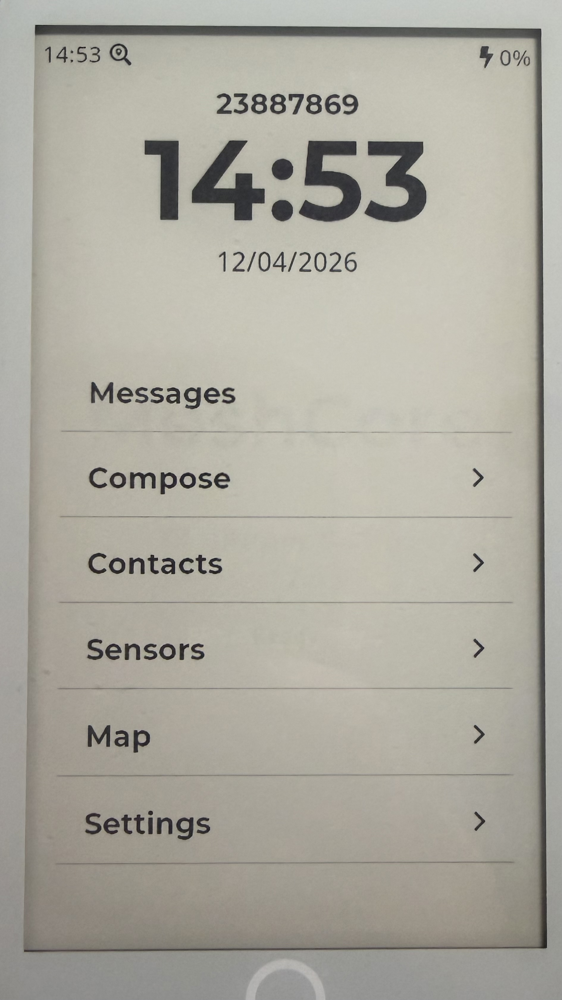
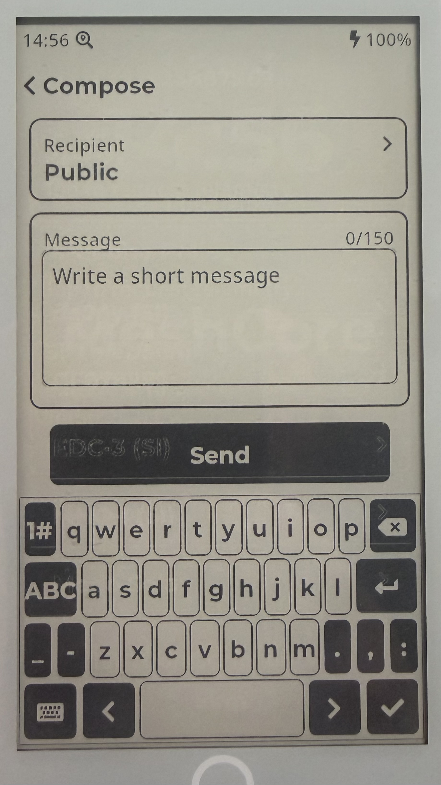
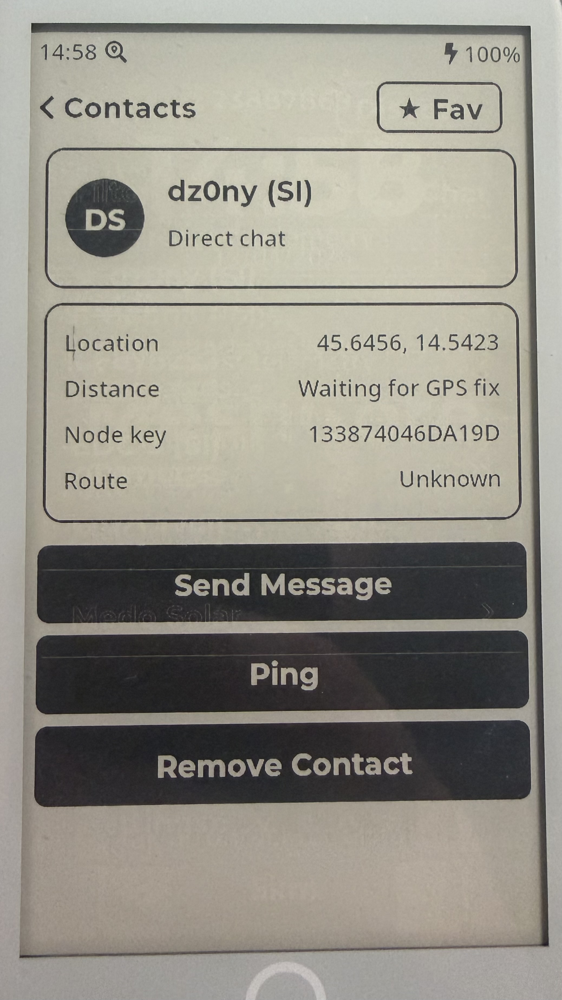
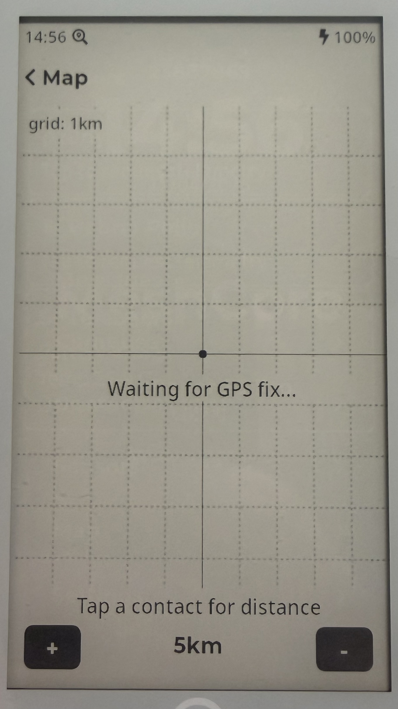
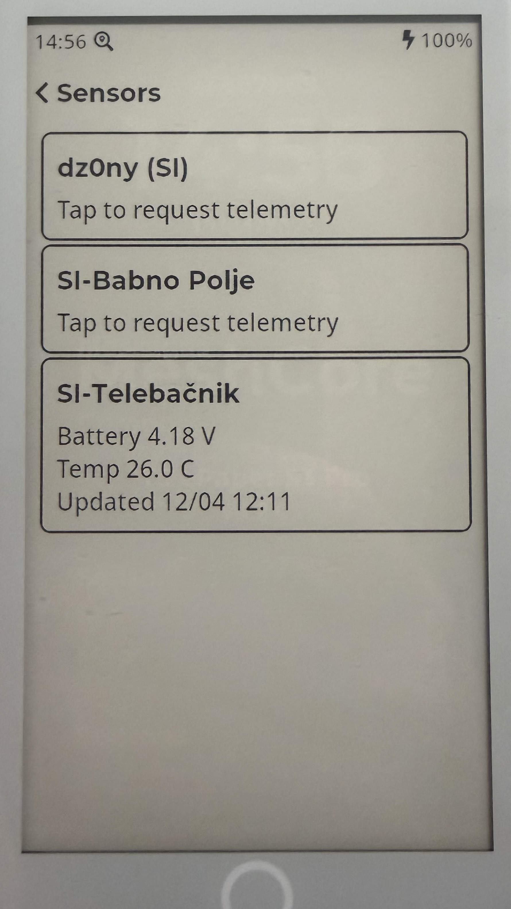

<h1 align="center">MeshCore T5 ePaper S3 Pro</h1>

<p align="center">
  A paper-like handheld MeshCore communicator for the LilyGo T5 ePaper S3 Pro
</p>

<p align="center">
  
  
  
  <a href="https://dz0ny.github.io/meshcore-t5-epaper-s3-pro/"></a>
</p>

<p align="center">
  
</p>

<p align="center">
  
  
  
  
</p>

MeshCore T5 ePaper S3 Pro turns the LilyGo T5 ePaper S3 Pro into a dedicated long-range mesh messaging device with a calm, readable e-ink interface.
It is built for people who want simple off-grid communication, strong battery-friendly readability, and a UI that feels more like paper than a phone.
It can be used as a standalone mesh device or as a companion-connected MeshCore node.

An SD card is required for normal use.

## Why This Device

- Readable in daylight with an always-on e-paper feel
- Built for low-distraction messaging and status checking
- Long-range LoRa mesh communication without relying on normal internet access
- Purpose-built interface instead of a generic developer demo

## What You Can Do

- Send and receive mesh messages
- Browse contacts and recent conversations
- Discover nearby or recently heard nodes
- Check battery, GPS, and radio status
- Configure display, mesh, BLE, storage, and device settings directly on the device
- Use it as a companion-connected device as well as a standalone handheld

## Screens

- Home screen with time and at-a-glance device status
- Contacts list and contact detail views
- Chat list, message detail, and compose screens
- Discovery screen for recently heard mesh nodes
- Status, battery, GPS, map, and sensors screens
- Settings screens for mesh, display, BLE, GPS, and storage

## Main Functions

- 1:1 and device-to-device mesh messaging
- Standalone operation or companion-connected MeshCore use
- Contact management directly on the handheld
- Node discovery and quick visibility into nearby mesh activity
- On-device battery, radio, and location awareness
- Simple touch navigation optimized for e-paper readability

## Experience

The interface is designed around the strengths of e-paper:

- Large readable typography
- Minimal visual noise
- Clear black-and-white presentation
- Fast access to the most important actions
- No animation-heavy UI patterns

## Built For

- Off-grid communication setups
- Outdoor field use
- Low-power portable mesh terminals
- People who prefer dedicated hardware over a phone-first workflow

## Install

### Browser Flasher

The easiest way to install the latest build is through the web flasher:

[Open Web Flasher](https://dz0ny.github.io/meshcore-t5-epaper-s3-pro/)

Use Chrome or Edge and connect the device with a USB data cable.

If the board is not detected, hold `BOOT` and tap `RESET`.

### Local Build

```bash
# PlatformIO environment name: t5-epaper
uvx platformio run -e t5-epaper
```

Flash over USB:

```bash
# PlatformIO environment name: t5-epaper
uvx platformio run -e t5-epaper -t upload
```

## Hardware

- LilyGo T5 ePaper S3 Pro
- ESP32-S3
- 4.7" e-paper display
- SX1262 LoRa radio
- Capacitive touch
- GPS support
- On-device storage with SPIFFS and SD card

Product page: [lilygo.cc/en-us/products/t5-e-paper-s3-pro](https://lilygo.cc/en-us/products/t5-e-paper-s3-pro)

## Project Focus

This project is not trying to be a general-purpose tablet UI.
It is a focused mesh communicator with a paper-like display, tuned for clarity, simplicity, and practical field use.

## Repository

- GitHub: [dz0ny/meshcore-t5-epaepr-pro](https://github.com/dz0ny/meshcore-t5-epaepr-pro)
